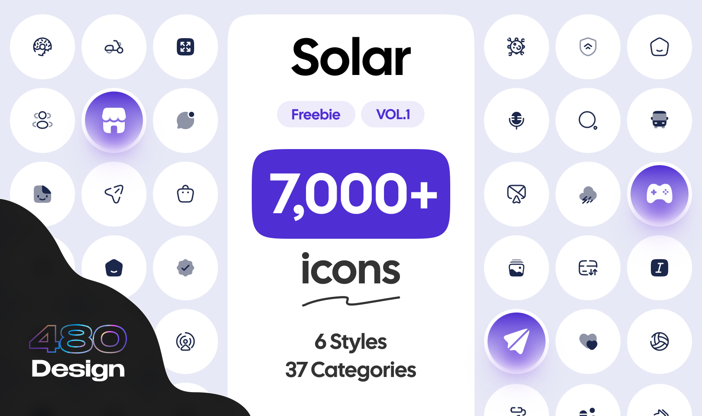

# Solar Icon Set

Solar Icon Set - free giant pack of icons. Drawn from scratch. Six styles, perfect balance, we have everything you could ever need in React.



## Install

```
npm i solar-icon-set
```

## Usage

```jsx
import { DocumentBold } from "solar-icon-set"

function App() {
  return <DocumentBold color="#1C274C" size={24} />
}
```

## Prop Types

| Property | Type                 | Required | Default          | Description                                 |
|:---------|:---------------------|:--------:|:-----------------|---------------------------------------------|
| color    | `string`             |    No    | `"currentColor"` | Icon fill color                             |
| size     | `number` or `string` |    No    | `16`             | Icon size in pixels, or string with unit    |
| ...props | `SVGSVGElement`      |    No    | `undefined`      | All other props to be passed to SVG element |